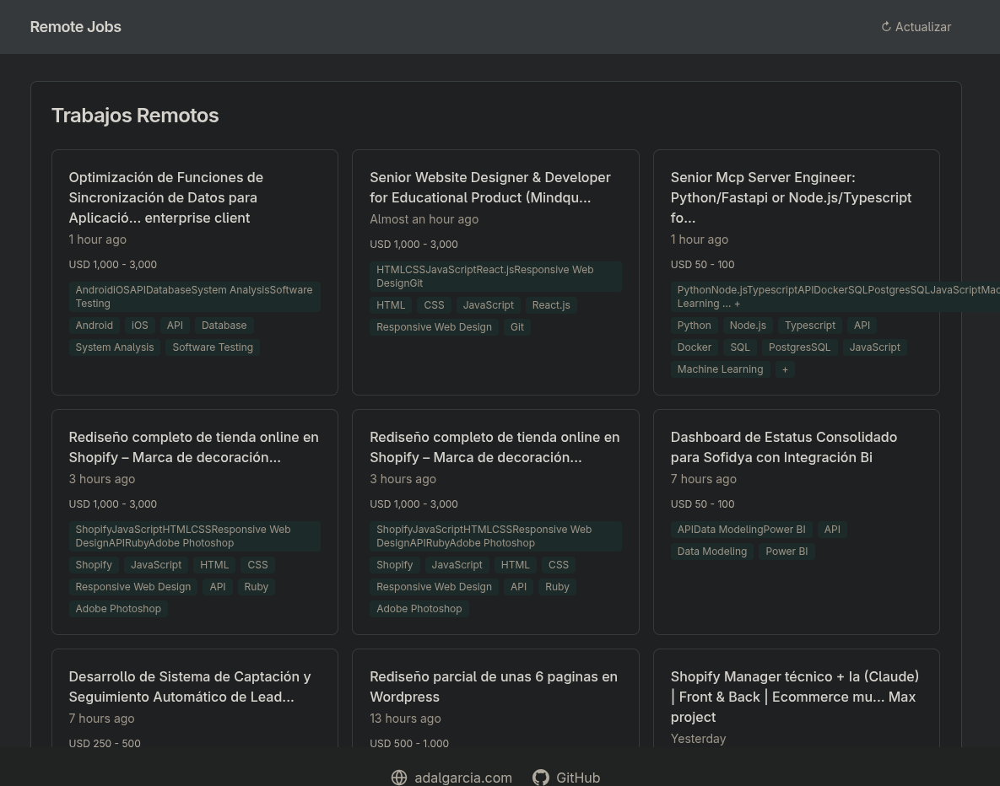

# FrontendWorkList

[](https://github.com/anomalyco/frontendWorkScrapping/actions)

Frontend público que muestra ofertas de trabajo scrapeadas de freelancer.com, extraídas y servidas desde una API propia. Este sitio ofrece una experiencia de usuario mejorada con diseño adaptable, soporte para modo claro/oscuro (theming) y accesibilidad optimizada.

## Demo

[workscrap.adalgarcia.com](https://workscrap.adalgarcia.com)

## Características

- Listado de trabajos remotos actualizados diariamente.
- Diseño responsive, accesible y adaptable con Tailwind CSS.
- Soporte para modo claro/oscuro (theming) configurable.
- Mejoras significativas en accesibilidad y experiencia de usuario.
- Integración con API REST para obtener datos de trabajos.

## Tech Stack

- [Astro](https://astro.build) + Vite
- [Tailwind CSS](https://tailwindcss.com)
- [pnpm](https://pnpm.io)

## Getting Started

### Requisitos

- Node.js 22+
- pnpm 9+

### Instalación

```bash
pnpm install
```

### Variables de entorno

| Variable  | Descripción               | Default                            |
| --------- | ------------------------- | ---------------------------------- |
| `API_URL` | URL de la API de trabajos | `https://workscrap.adalgarcia.com` |

### Scripts

| Comando       | Descripción                                |
| ------------- | ------------------------------------------ |
| `pnpm dev`    | Inicia servidor dev en `localhost:4321`    |
| `pnpm build`  | Genera build de producción en `./dist/`    |
| `pnpm preview` | Preview del build local antes de desplegar |

## Estructura del proyecto

```
src/
├── components/     # Componentes Astro reutilizables
│   ├── Header.astro
│   ├── Footer.astro
│   ├── Listworks.astro
│   ├── ThemeProvider.astro # Componente para gestionar el tema de la UI
│   └── Welcome.astro # (Opcional, si ya no se usa)
├── layouts/        # Layouts base
│   └── Layout.astro
├── pages/         # Páginas routing
│   └── index.astro
└── styles/        # Estilos globales
    └── global.css
```

## API

Consume datos de la siguiente endpoint:

```
GET https://workscrap.adalgarcia.com/listwork
```

Respuesta esperada:

```json
{
  "data": [
    {
      "id": "string",
      "title": "string",
      "description": "string",
      "budget": "string",
      "skills": ["JavaScript", "React"], # Ejemplo de skills filtrados
      "url": "string",
      "postedDate": "string",
      "extractedAt": "string",
      "paymentVerified": boolean,
      "bids": "string"
    }
  ]
}
```

## Despliegue

El proyecto está configurado para desplegarse en Railway usando nixpacks. La siguiente configuración `railway.toml` (o similar) debe ser suficiente:

```toml
[phases.setup]
nixPkgs = ['nodejs_22']

[phases.install]
cmds = ['pnpm install --frozen-lockfile']

[phases.build]
cmds = ['pnpm build']

[start]
cmd = 'pnpm preview'

[variables]
NODE_ENV = 'production'
```

## Screenshots

 <!-- Asegúrate de que esta captura refleje el diseño actual, incluyendo el modo oscuro/claro. -->

## Licencia

MIT
